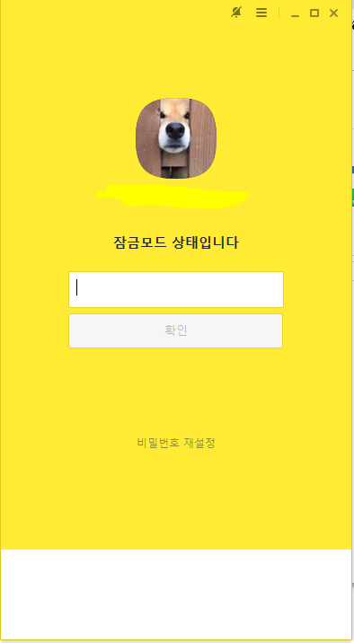

# PC 카카오톡 광고제거기

##### =============================================================================
##### 해당 프로그램은 PC 카카오톡하단에 뜨는 광고를 제거해주는 역할을합니다
##### 해당 프로그램은 첫실행시 시작프로그램 레지스트에 등록을 해줘 컴퓨터가 실행될때마다 자동으로 실행되어
##### 광고부분을 삭제해줍니다.
##### ==============================================================================

### - 프로그램 작동 사진

##### =============================================================================
##### 광고가 삭제된후에는 프로그램이 자동으로 종료됩니다.
##### 프로그램이 종료된이후 카카오톡을 재실행하셨다면 delKakaoad.exe를 다시실행해주세요
##### 재실행시 레지스트값은 중복 등록되지않으며 마찬가지로 광고삭제후 자동종료됩니다.
##### 프로그램을 더이상 사용하지않을시 delreg.exe를 실행하여 등록된 레지스트값을 삭제해주세요.
##### ==============================================================================

파일 다운받기 : <https://github.com/dobidugi/delete_pckakao_ad/releases/tag/v0.1>
